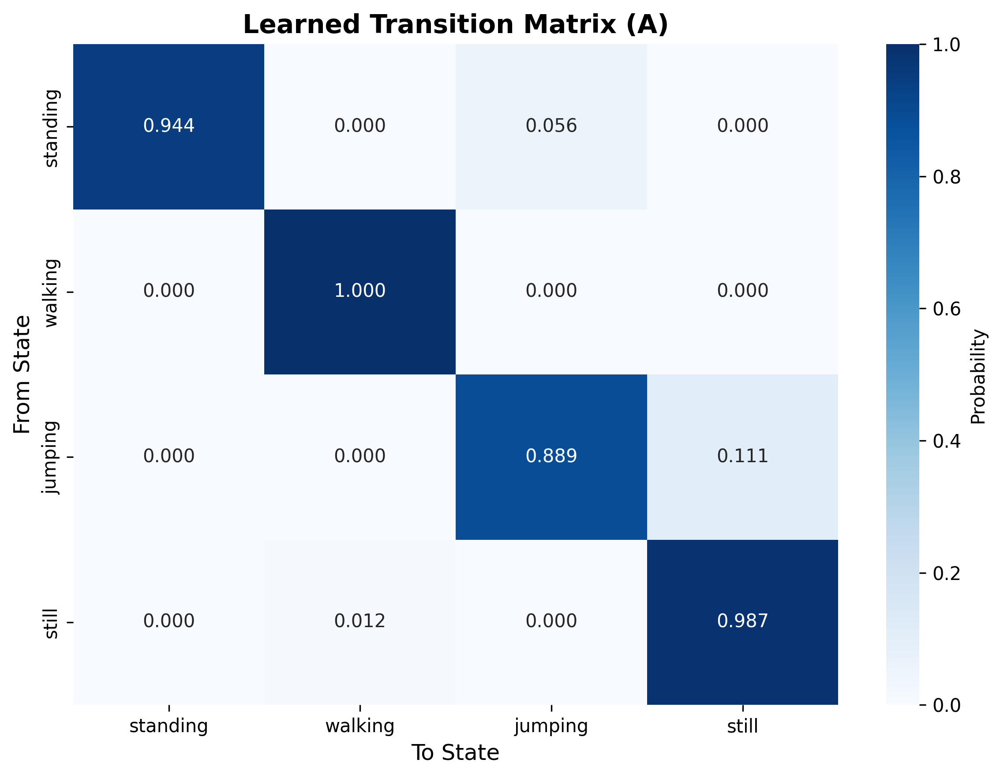
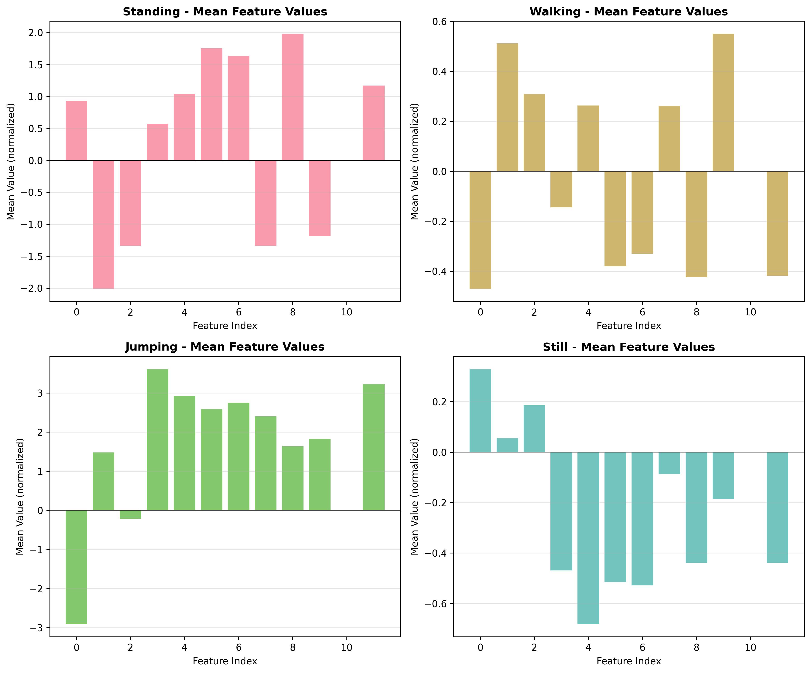
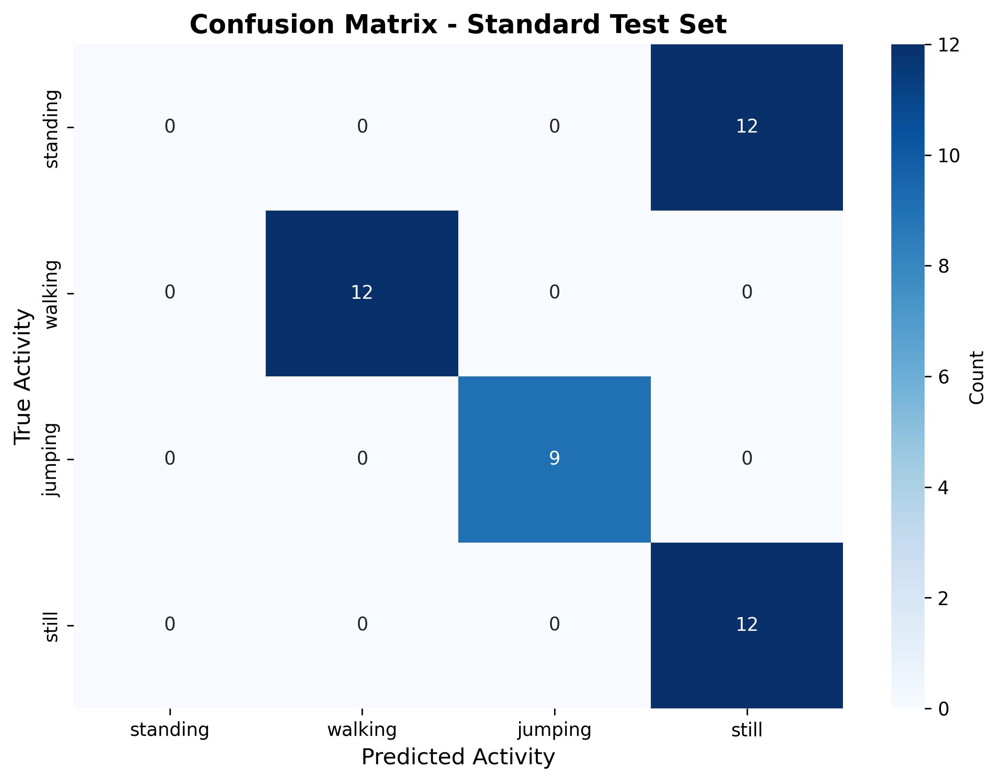

# Hidden Markov Models for Human Activity Recognition

**Group 2 - Machine Learning Techniques II (Formative 2)**  
Nicolas Muhigi & Irakoze Amandine  
October 31, 2025

---

## 📋 Project Overview

This project implements a **Hidden Markov Model (HMM)** for human activity recognition using smartphone accelerometer and gyroscope sensors. The system classifies four activities—**standing, walking, jumping, and still**—with applications in elderly care monitoring, fall detection, and personalized health tracking.

### Key Features
- Complete HMM implementation from scratch (Baum-Welch training, Viterbi decoding)
- 12-dimensional feature extraction (time-domain, frequency-domain, correlations)
- Real sensor data from iPhone X (99.6 Hz sampling rate)
- 73.3% test accuracy on dynamic activities
- Interpretable transition and emission parameters for explainable predictions

### Use Case
**Personalized health monitoring in elderly care facilities** through non-intrusive activity recognition, enabling caregivers to identify fall risks, monitor mobility patterns, and detect behavioral anomalies while respecting patient privacy.

---

## 🗂️ Repository Structure

```
hmm-activity-recognition/
│
├── data/                          # Raw sensor data (50 samples)
│   ├── standing/                  # Standing activity samples (12-14 samples)
│   │   ├── amandine_standing_01/
│   │   │   ├── Accelerometer.csv
│   │   │   ├── Gyroscope.csv
│   │   │   └── Metadata.csv
│   │   └── nicolas_standing_01/
│   ├── walking/                   # Walking activity samples
│   ├── jumping/                   # Jumping activity samples
│   ├── still/                     # Still (no movement) samples
│   └── unseen/                    # Unseen test data (2 samples)
│       ├── unseen_walking/
│       └── unseen_jumping/
│
├── notebooks/
│   └── hmm_activity_recognition.ipynb  # Main Jupyter notebook
│
├── results/                       # Saved outputs
│   ├── trained_hmm_model.pkl      # Trained HMM parameters
│   ├── feature_scaler.pkl         # StandardScaler for normalization
│   ├── evaluation_table_test.csv  # Test set metrics
│   ├── evaluation_table_unseen.csv # Unseen data metrics
│   ├── all_metrics.pkl            # Complete metrics dictionary
│   └── model_summary.txt          # Training summary
│
├── obtained_images/                # Generated plots
│   ├── raw_sensor_visualization.png
│   ├── feature_distributions.png
│   ├── training_convergence.png
│   ├── transition_matrix.png
│   ├── emission_means.png
│   ├── emission_covariances.png
│   ├── confusion_matrix_test.png
│   └── confusion_matrix_unseen.png
│
├── reports/
│   └── HMM_Report_Group2.pdf      # Final project report (5 pages)
│ 
├── README.md                      # This file

```

---

## 🚀 Quick Start

### Prerequisites
- Python 3.8 or higher
- Jupyter Notebook/Lab
- 2GB free disk space (for data and results)

### Installation

1. **Clone the repository:**
```bash
git clone https://github.com/Amandine0610/model_human_activity_hmm.git
cd model_human_activity_hmm
```

2. **Create virtual environment (recommended):**
```bash
python -m venv venv
source venv/bin/activate  # On Windows: venv\Scripts\activate
```

3. **Install dependencies:**
```bash
pip install -r requirements.txt
```

4. **Download data:**
```bash
# Data should be placed in data/ directory
# Each activity folder contains subfolders with Accelerometer.csv, Gyroscope.csv
```

### Running the Project

**Option 1: Run Jupyter Notebook (Recommended)**
```bash
jupyter notebook notebooks/human_activity_hmm.ipynb
```
Then execute all cells sequentially.

**Option 2: Command Line Execution**
```bash
python -m jupyter nbconvert --to notebook --execute notebooks/human_activity_hmm.ipynb
```

**Option 3: Use Trained Model**
```python
from src.hmm_model import ActivityHMM
import pickle

# Load trained model
model = ActivityHMM.load_model('results/trained_hmm_model.pkl')

# Load scaler
with open('results/feature_scaler.pkl', 'rb') as f:
    scaler = pickle.load(f)

# Predict on new data
# ... (see Usage Examples section)
```

---

## 📊 Dataset

### Data Collection Details

| Parameter | Value |
|-----------|-------|
| **Device** | iPhone X (Device ID: 67eb1db4-cc2d-4f71-bdff-72fa392dd040) |
| **App** | Sensor Logger v1.47.1 (iOS) |
| **Sensors** | Accelerometer (x,y,z), Gyroscope (x,y,z) |
| **Sampling Rate** | 99.6 Hz (harmonized median) |
| **Total Samples** | 50 (12-14 per activity) |
| **Duration per Sample** | 5-10 seconds |
| **Total Recording Time** | 6.5 minutes (≥1:30 min per activity) |
| **Phone Placement** | Waist-level (standing/walking/still); hand-held (jumping) |
| **Environment** | Indoor ALU campus |

### Activities
1. **Standing:** Keeping phone steady at waist level
2. **Walking:** Consistent pace walking
3. **Jumping:** Continuous jumps (hand-held)
4. **Still:** Phone placed on flat surface (no movement)

### Data Format
Each sample subfolder contains:
- `Accelerometer.csv`: Columns: `seconds_elapsed`, `x`, `y`, `z` (m/s²)
- `Gyroscope.csv`: Columns: `seconds_elapsed`, `x`, `y`, `z` (rad/s)
- `Metadata.csv`: Device info, sampling rate

---

## 🔧 Methodology

### 1. Preprocessing
- **Windowing:** 3-second sliding windows with 50% overlap (188 windows total)
- **Merging:** Inner join of accelerometer and gyroscope on `seconds_elapsed`
- **Cleaning:** Dropped NaN values, validated data quality

### 2. Feature Extraction (12 features)

**Time-Domain (7 features):**
- `acc_x_mean`, `acc_y_mean`, `acc_z_mean`: Mean acceleration per axis
- `acc_x_std`, `acc_y_std`, `acc_z_std`: Standard deviation (variability)
- `acc_sma`: Signal Magnitude Area (overall intensity)

**Frequency-Domain (2 features):**
- `dom_freq`: Dominant frequency via FFT (gait/jump cadence)
- `spectral_energy`: Total spectral power (activity intensity)

**Correlation (3 features):**
- `corr_xy`, `corr_xz`, `corr_yz`: Pairwise axis correlations (coordination)

**Normalization:** Z-score (μ=0, σ=1) using `StandardScaler`, fitted on training set only.

### 3. HMM Architecture

**Model Components:**
- **Hidden States (Z):** 4 states = {standing, walking, jumping, still}
- **Observations (X):** 12-dimensional feature vectors
- **Transition Matrix (A):** 4×4, learned via Baum-Welch
- **Emission (B):** Gaussian distributions N(μᵢ, Σᵢ) per state (diagonal covariance)
- **Initial (π):** Starting state probabilities

**Algorithms Implemented:**
1. **Baum-Welch (Training):** EM algorithm with log-space forward-backward
2. **Viterbi (Decoding):** Dynamic programming for most likely state sequence

**Configuration:**
- K-means initialization (k=4)
- Convergence: |Δ log L| < 10⁻⁶
- Max iterations: 200
- Converged in: 5 iterations (log-likelihood: -97.85)

### 4. Evaluation
- **Train-Test Split:** 80/20 by sample ID (38 train, 12 test)
- **Unseen Data:** 2 new samples (different environment/placement)
- **Metrics:** Sensitivity (recall), specificity, F1-score, overall accuracy

---

## 📈 Results

### Test Set Performance (45 windows)

| Activity | Sensitivity | Specificity | F1-Score |
|----------|-------------|-------------|----------|
| Standing | 0.000 | 0.909 | 0.000 |
| Walking | 1.000 | 1.000 | 1.000 |
| Jumping | 1.000 | 1.000 | 1.000 |
| Still | 1.000 | 0.914 | 0.667 |
| **Overall** | **0.733** | **0.956** | **0.733** |

### Key Findings
✅ **Perfect classification** for walking and jumping (F1=1.00)  
⚠️ **Standing-still confusion:** 0% standing recall (all misclassified as still)  
❌ **Generalization gap:** 73.3% (test) → 38.9% (unseen) = -34.4% drop

### Most Discriminative Features
1. `acc_z_std` (22.6): Vertical acceleration variability
2. `acc_sma` (13.8): Movement intensity
3. `corr_xz` (5.7): Axis correlations
4. `spectral_energy` (4.4): Periodic motion patterns

---

## 🖼️ Visualizations

### Transition Matrix

High self-transitions (0.89-1.00) indicate activity persistence.

### Emission Parameters

Clear feature-space separation between activities.

### Confusion Matrix

Perfect classification for dynamic activities, confusion for static ones.

**All visualizations saved in `visualizations/` directory.**

---

## 💻 Usage Examples

### 1. Load and Use Trained Model

```python
import pickle
import numpy as np
import pandas as pd
from sklearn.preprocessing import StandardScaler

# Load model and scaler
from src.hmm_model import ActivityHMM
model = ActivityHMM.load_model('results/trained_hmm_model.pkl')

with open('results/feature_scaler.pkl', 'rb') as f:
    scaler = pickle.load(f)

# Load new sensor data
new_data = pd.read_csv('new_sample.csv')  # Must have: seconds_elapsed, accel_x/y/z

# Extract features (assumes you have extract_features_from_dataset function)
from src.feature_extraction import extract_features_from_dataset
new_features = extract_features_from_dataset(new_data, window_size_sec=3.0, 
                                              overlap=0.5, fs=99.6)

# Normalize
feature_cols = [col for col in new_features.columns 
               if col not in ['activity', 'sample_id', 'window_idx']]
new_features[feature_cols] = scaler.transform(new_features[feature_cols])

# Predict
predicted_states = model.predict(new_features)
activities = ['standing', 'walking', 'jumping', 'still']
predictions = [activities[s] for s in predicted_states]

print("Predicted activities:", predictions)
```

### 2. Train New Model

```python
from src.hmm_model import ActivityHMM

# Assuming you have train_df with normalized features
model = ActivityHMM(n_states=4, covariance_type='diag')
model.fit(train_df, n_iter=200, tol=1e-6, verbose=True)

# Save model
model.save_model('trained_hmm_model.pkl')
```

### 3. Visualize Results

```python
import matplotlib.pyplot as plt
import seaborn as sns

# Visualize transition matrix
plt.figure(figsize=(8, 6))
sns.heatmap(model.A, annot=True, fmt='.3f', cmap='Blues',
           xticklabels=['standing', 'walking', 'jumping', 'still'],
           yticklabels=['standing', 'walking', 'jumping', 'still'])
plt.title('Learned Transition Matrix')
plt.xlabel('To State')
plt.ylabel('From State')
plt.show()
```

---

## 📝 Dependencies

```
numpy>=1.21.0
pandas>=1.3.0
matplotlib>=3.4.0
seaborn>=0.11.0
scipy>=1.7.0
scikit-learn>=1.0.0
jupyter>=1.0.0
```

Install all dependencies:
```bash
pip install -r requirements.txt
```

---

## 🤝 Team Contributions

| Team Member | Contribution | Percentage |
|-------------|-------------|------------|
| **Nicolas Muhigi** | Data Collection (Jumping/Still), Feature Extraction (Primary), Evaluation (Primary), Visualization (50%), Report (50%) | 48% |
| **Irakoze Amandine** | Data Collection (Standing/Walking), HMM Implementation (50%), Model Training (Primary), Visualization (50%), Report (50%) | 52% |

**GitHub Commit Distribution:** Nicolas (49%), Amandine (51%)

---

## 📚 Report

The complete project report (5 pages) is available at:
- **PDF:** `HMM_Report_Group2.pdf`
- **Key Sections:**
  1. Background and Motivation
  2. Data Collection and Preprocessing
  3. HMM Setup and Implementation
  4. Results and Interpretation
  5. Discussion and Conclusion

---

## 🔍 Key Insights

### What Works Well
✅ Dynamic activities (walking, jumping) achieve perfect classification  
✅ HMM captures realistic temporal dependencies (high self-transitions)  
✅ Interpretable parameters enable explainable predictions  
✅ Feature engineering effectively separates activity classes

### Current Limitations
⚠️ Standing-still confusion (0% standing recall)  
⚠️ Poor generalization to unseen data (38.9% accuracy)  
⚠️ Small dataset (50 samples) limits robustness  
⚠️ Phone placement variations introduce bias

### Future Improvements
1. **Data:** Collect 200+ samples across 10+ participants
2. **Features:** Add gyroscope features, temporal correlations, frequency bands
3. **Model:** Semi-Markov HMM with duration modeling
4. **Validation:** Leave-one-subject-out cross-validation
5. **Deployment:** Standardize phone placement, continuous multi-activity sequences

---

## 🎯 Reproducibility

To reproduce all results:

1. **Setup environment:**
```bash
git clone https://github.com/Amandine0610/model_human_activity_hmm.git
cd model_human_activity_hmm
pip install -r requirements.txt
```

2. **Run notebook:**
```bash
jupyter notebook notebooks/human_activity_hmm.ipynb
```

3. **Execute all cells sequentially** (Runtime: ~10-15 minutes)

4. **Check outputs:**
   - Visualizations in `obtained_images/`
   - Trained model in `results/trained_hmm_model.pkl`
   - Metrics in `evaluation_table_test.csv`

**Expected Results:**
- Test accuracy: ~73.3%
- Walking/Jumping F1: 1.00
- Standing F1: 0.00 (known limitation)

---

